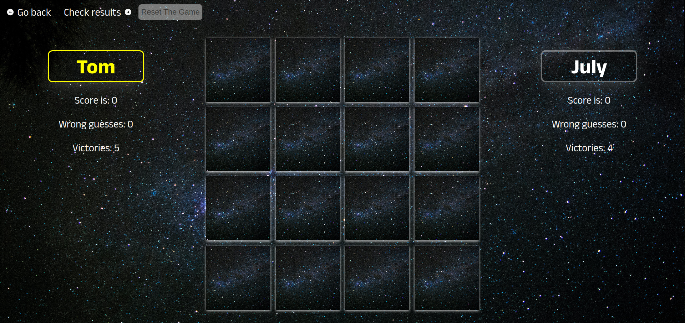

# MemoryGame

Tools: React, JavaScript, Node, Axios, MUI, SASS

About the Game: 
The game starts with all the cards face down and players take turns turning over two cards. If the two cards have the same picture, then they keep the cards, otherwise, they turn the cards face down again. The winner is the person with the most cards when all the cards have been taken. 

